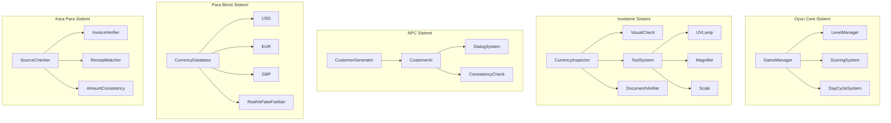

# Money or Honey - Oyun Gelistirme Plani

## Genel Bakis

Papers, Please'ten ilham alan, bankada vezneci olarak calisan oyuncunun sahte para, kara para ve supheli islemleri tespit etmeye calistigi 2D pixel art web oyunu. Godot 4.x motoru ile gelistirilecek, HTML5 olarak export edilecek.

## Mimari



## Proje Klasor Yapisi

```
money-or-honey/
├── project.godot
├── assets/
│   ├── sprites/
│   │   ├── currencies/          # Para birimi gorselleri
│   │   │   ├── usd/
│   │   │   ├── eur/
│   │   │   └── gbp/
│   │   ├── npcs/                # Musteri sprite'lari
│   │   ├── tools/               # UV lamba, buyutec vb.
│   │   ├── ui/                  # Arayuz elementleri
│   │   ├── documents/           # Fatura, dekont, kimlik
│   │   └── backgrounds/         # Banka arka planlari
│   ├── fonts/                   # Pixel fontlar
│   └── audio/                   # Ses efektleri ve muzik
├── scenes/
│   ├── main/
│   │   ├── MainMenu.tscn
│   │   └── Game.tscn
│   ├── gameplay/
│   │   ├── TellerDesk.tscn      # Vezne masasi
│   │   ├── InspectionArea.tscn  # Inceleme alani
│   │   └── DayEndReport.tscn    # Gun sonu raporu
│   ├── npcs/
│   │   └── Customer.tscn
│   ├── currency/
│   │   └── Banknote.tscn
│   └── ui/
│       ├── HUD.tscn
│       └── ToolPanel.tscn
├── scripts/
│   ├── autoload/                # Singleton scriptler
│   │   ├── GameManager.gd
│   │   ├── LevelManager.gd
│   │   ├── ScoringSystem.gd
│   │   └── CurrencyDatabase.gd
│   ├── gameplay/
│   │   ├── CurrencyInspector.gd
│   │   ├── ToolSystem.gd
│   │   ├── DocumentVerifier.gd
│   │   └── CustomerAI.gd
│   ├── currency/
│   │   ├── Banknote.gd
│   │   └── CurrencyData.gd
│   └── ui/
│       ├── HUD.gd
│       └── DayEndReport.gd
├── data/
│   ├── currencies.json          # Para birimi verileri
│   ├── levels.json              # Seviye tanimlari
│   ├── customers.json           # Musteri profilleri
│   └── fake_patterns.json       # Sahte para desenleri
└── export/
    └── web/                     # HTML5 export
```

## Temel Oyun Mekanikleri

### 1. Para Inceleme Sistemi

**Gorsel Kontrol:**
- Renk tonu farkliliklari (sahte paralarda hafif farkli tonlar)
- Boyut farkliliklari (1-2mm sapma)
- Desen detaylari (cizgi kalinligi, motif netligi)
- Hologram/su damgasi kontrolu
- Seri numarasi formati ve tutarliligi

**Araclar:**
- **UV Lamba**: Gercek paralardaki UV ile gorunen guvenlik izlerini gosterir
- **Buyutec**: Detayli inceleme icin buyutme (seri no, mikro yazilar)
- **Terazi**: Agirlik kontrolu (gercek para belirli agirlikta)
- **Mikroskop**: Cok yuksek detay inceleme (ileri seviyelerde)

### 2. Belge Kontrol Sistemi

**Eslestirmeler:**
- Fatura miktari vs para miktari
- Dekont bilgileri vs musteri beyani
- Kimlik uzerindeki isim vs musteri adi
- Islem amaci vs para kaynagi

**Tutarlilik Kontrolleri:**
- Musterinin beyan ettigi islem amaci ile miktar uyumu
- Siklik kontrolleri (ayni musteri cok sik geliyorsa)
- Kaynak ulke ile para birimi uyumu

### 3. Kara Para Tespiti

**Isaretler:**
- Supheli buyuk miktarlar (gunluk limit uzeri)
- Tutarsiz kaynak hikayeleri
- Sahte veya eksik belgeler
- Musterinin davranis degisiklikleri (gerginlik, acele)
- Bankacilik gecmisinde anomaliler

### 4. Musteri (NPC) Sistemi

**Musteri Tipleri:**
- Normal musteriler (sorunsuz islemler)
- Dikkatsiz musteriler (eksik belge ama iyi niyetli)
- Supheli musteriler (kara para veya sahte para)
- Profesyonel dolandiricilar (cok iyi sahtecilik)

**Diyalog Sistemi:**
- Musteri islem amacini belirtir
- Oyuncu soru sorabilir (sinirli sayida)
- Yanitlar tutarli veya tutarsiz olabilir
- Tutarlilik puani hesaplanir

### 5. Gun Dongusu

**Gunluk Akis:**
1. Gun baslangici: Bilgilendirme (yeni kurallar, uyariar)
2. Mesa baslangici: Ilk musteri gelir
3. Islemler: Para inceleme, belge kontrolu, karar verme
4. Gun sonu: Rapor (dogru/yanlis kararlar, kazanc, cezalar)
5. Seviye ilerlemesi veya tekrar

**Zaman Baskisi:**
- Her islem icin sinirli sure
- Kuyrukta bekleyen musteriler
- Cok yavas islem = musteri sikayeti = puan dususu

## Para Birimi Sistemi

### Ilk 3 Para Birimi

**USD (ABD Dolari):**
- $1, $5, $10, $20, $50, $100
- Sahte desenleri: Renk soluklugu, hologram eksikligi, yanlis seri no formati
- Guvenlik ozellikleri: 3D bant, renk degisen murekkep, su damgasi

**EUR (Euro):**
- 5, 10, 20, 50, 100, 200, 500
- Sahte desenleri: Yanlis boyut, eksik hologram, farkli kagit kalitesi
- Guvenlik ozellikleri: Hologram serit, watermark, guvenlik ipligi

**GBP (Ingiliz Sterlini):**
- 5, 10, 20, 50
- Sahte desenleri: Yanlis kabartma, farkli UV yaniti, boyut sapmasi
- Guvenlik ozellikleri: Hologram, metallic patch, raised print

### Sahte Para Seviyeleri

1. **Kolay Sahte**: Belirgin farklar (renk, boyut, kalite)
2. **Orta Sahte**: Daha ince farklar (UV yaniti, mikro yazilar)
3. **Zor Sahte**: Cok iyi kopyalar (sadece detayli inceleme ile)
4. **Profesyonel Sahte**: Neredeyse kusursuz (coklu arac gerekli)

## Seviye Tasarimi (5 Seviye)

### Seviye 1: "Is Baslangici"
- **Para Birimi**: Sadece USD
- **Mekanikler**: Temel gorsel inceleme (renk, boyut)
- **Musteri**: 5 musteri, hepsi normal/dikkatsiz
- **Sahte**: 2 kolay sahte (belirgin farklar)
- **Ogrenme**: Arac kullanimi yok, sadece gozle inceleme
- **Hedef**: 4/5 dogru karar

### Seviye 2: "Arac Kutusu"
- **Para Birimi**: USD + EUR
- **Mekanikler**: Buyutec + UV lamba eklenir
- **Musteri**: 8 musteri, 1 supheli
- **Sahte**: 3 orta seviye sahte
- **Ogrenme**: Araclarin kullanimi, UV izleri
- **Hedef**: 6/8 dogru karar

### Seviye 3: "Belge Kontrolu"
- **Para Birimi**: USD + EUR + GBP
- **Mekanikler**: Fatura/dekont eslestirme eklenir
- **Musteri**: 10 musteri, 2 supheli, 1 kara para
- **Sahte**: 4 sahte (2 orta, 2 zor)
- **Ogrenme**: Belge kontrolu, tutarlilik kontrolu
- **Hedef**: 8/10 dogru karar

### Seviye 4: "Kara Para Avcisi"
- **Para Birimi**: USD + EUR + GBP
- **Mekanikler**: Kara para tespiti, kaynak kontrolu
- **Musteri**: 12 musteri, 3 supheli, 2 kara para
- **Sahte**: 5 sahte (1 zor, 2 profesyonel)
- **Ogrenme**: Kara para isaretleri, davranis analizi
- **Hedef**: 10/12 dogru karar + kara paralarin tumu

### Seviye 5: "Uzman Vezneci"
- **Para Birimi**: USD + EUR + GBP
- **Mekanikler**: Tum mekanikler, zaman baskisi artar
- **Musteri**: 15 musteri, 4 supheli, 3 kara para, 1 profesyonel dolandirici
- **Sahte**: 6 sahte (2 profesyonel)
- **Ogrenme**: Hizi ve dogrulugu birlestirme
- **Hedef**: 13/15 dogru karar + tum kara paralar + profesyoneli yakalama

## Asset Uretim Plani

### Pixel Art Stil Kilavuzu

**Cozunurluk:**
- Sprite'lar: 32x32, 64x64, 128x128 (objeye gore)
- Para birimleri: 256x128 pixel (gercek banka not orani)
- Karakterler: 64x64 pixel
- UI elementleri: 16x16, 32x32, 64x64

**Renk Paleti:**
- Sinirli palet (Papers Please tarzi): ~32 renk
- Banka ortami: Soluk yesiller, griler, kahverengiler
- Paralar: Gercekci renkler ama hafif stilize
- UI: Kontrast yukseklik, okunakli

**Animasyonlar:**
- Karakterler: 4-6 kare yuruyus, 2-3 kare idle
- Para: Yavas kayma animasyonu (masaya birakma)
- Araclar: 3-4 kare kullanim animasyonu
- UI: Basit fade-in/fade-out

### Uretilecek Assetler

**Para Birimleri (her biri icin gercek + sahte versiyon):**
- USD: $1, $5, $10, $20, $50, $100 (12 sprite)
- EUR: 5, 10, 20, 50, 100, 200, 500 (14 sprite)
- GBP: 5, 10, 20, 50 (8 sprite)
- Toplam: 34 para sprite'i + sahte varyantlar

**NPC'ler:**
- 10 farkli musteri tipi (farkli kiyafet, yas, cinsiyet)
- Her biri icin: idle, konusma, tepki (kizgin, mutlu, gergin)
- Toplam: ~60 karakter sprite'i

**Araclar:**
- UV lamba: 4 kare animasyon
- Buyutec: 3 kare animasyon
- Terazi: 3 kare animasyon
- Mikroskop: 4 kare animasyon
- Toplam: ~14 arac sprite'i

**Belgeler:**
- Fatura: 5 farkli format
- Dekont: 5 farkli format
- Kimlik: 10 farkli format
- Toplam: ~20 belge sprite'i

**UI Elementleri:**
- Banka veznesi arka plani
- Para ust uste koyma elementleri
- Onay/Red butonlari
- Skor paneli
- Zamanlayici
- Alet paneli
- Gun sonu raporu ekrani
- Toplam: ~50 UI sprite'i

**Arka Planlar:**
- Banka ic mekan (3 farkli gun/saat)
- Disari pencere gorunumu
- Toplam: ~3 arka plan

## Teknik Detaylar

### Godot 4.x Yapilandirmasi

**Proje Ayarlari:**
- Render: OpenGL 3 (web uyumlulugu icin)
- Cozunurluk: 1280x720 (16:9)
- Pixel art: Texture filter = Nearest
- Fizik: 60 FPS

**HTML5 Export:**
- Thread support: Devre disi (genis uyumluluk)
- GDNative: Kullanilmayacak (saf GDScript)
- Dosya boyutu hedefi: <50MB

### Temel Script Yapis

**GameManager.gd (Autoload):**
```gdscript
extends Node

var current_level: int = 1
var current_day: int = 1
var score: int = 0
var money: int = 0
var correct_decisions: int = 0
var wrong_decisions: int = 0

func start_day():
    # Gun baslangici islemleri
    
func end_day():
    # Gun sonu raporu
    
func make_decision(is_correct: bool):
    # Karar kaydi ve skor guncelleme
```

**CurrencyInspector.gd:**
```gdscript
extends Node

var current_banknote: Banknote
var active_tool: ToolType = ToolType.NONE

func inspect_banknote(banknote: Banknote):
    current_banknote = banknote
    
func use_tool(tool: ToolType):
    active_tool = tool
    # Arac spesifik inceleme baslat
    
func check_authenticity() -> Dictionary:
    # Tum kontrolleri yap, sonuc dondur
```

**CustomerAI.gd:**
```gdscript
extends Node

var customer_type: CustomerType
var consistency_score: float = 1.0
var dialog_responses: Array[String]

func generate_customer(level: int):
    # Seviyeye gore musteri olustur
    
func respond_to_question(question: String) -> String:
    # Soruya cevap ver, tutarlilik kontrolu yap
    
func is_suspicious() -> bool:
    # Suphelilik kontrolu
```

## Gelisme Takvimi

### Faz 1: Temel Altyapi (Gun 1-2)
- Proje olusturma ve klasor yapisi
- Temel sahne yapisi (MainMenu, Game)
- GameManager autoload
- Basit UI sistemi

### Faz 2: Core Mekanikler (Gun 3-5)
- Para birimi sistemi (CurrencyDatabase)
- Temel inceleme mekanigi (gorsel kontrol)
- Karar verme sistemi (kabul/red)
- Skor sistemi

### Faz 3: Asset Uretimi (Gun 6-10)
- Para birimi sprite'lari (gercek + sahte)
- NPC sprite'lari
- UI elementleri
- Alet sprite'lari

### Faz 4: Ileri Mekanikler (Gun 11-14)
- Alet sistemi (UV, buyutec, terazi)
- Belge kontrol sistemi
- Musteri AI ve diyalog sistemi
- Kara para mekanigi

### Faz 5: Seviye Tasarimi (Gun 15-17)
- 5 seviye implementasyonu
- Seviye bazli mekanik tanitimi
- Zorluk ayari
- Gun sonu raporlari

### Faz 6: Polish ve Export (Gun 18-20)
- Ses efektleri ve muzik
- Animasyon iyilestirmeleri
- HTML5 export ve test
- Bug fix ve optimizasyon

## Gelecek Genisletmeler

**Mobile Port:**
- Touch kontrolleri
- Responsive UI
- Portrait/landscape destegi

**Yeni Icerik:**
- Ek para birimleri (JPY, CHF, AUD)
- Ek belge turleri (vize, calisma izni)
- Hikaye modu (ozel musteri senaryolari)
- Endless mode (sinirsiz gun)

**Gelistirilmis Mekanikler:**
- Musteri sadakati (duzenli musteriler)
- Banka itibari sistemi
- Upgrade sistemi (daha iyi araclar)
- Multiplayer (arkadaslarla yarisma)

## Riskler ve Cozumler

**Risk 1: Asset Uretim Suresi**
- Cozum: Basit pixel art stili, prosedural uretim aracları

**Risk 2: Web Export Performansi**
- Cozum: Duszuk cozunurluklu sprite'lar, minimize animasyon

**Risk 3: Oynanış Dengesi**
- Cozum: Erken playtest, iteratif zorluk ayari

**Risk 4: Godot Web Export Limitleri**
- Cozum: GDNative kullanmaktan kacin, saf GDScript

## Basari Kriterleri

- 5 seviye tam oynanabilir
- 3 para birimi (USD, EUR, GBP) calisir durumda
- 4 farkli arac (UV, buyutec, terazi, mikroskop)
- Sahte para, kara para, belge kontrolu mekanikleri calisir
- HTML5 olarak tarayicida calisir
- 60 FPS performans
- <50MB dosya boyutu