# Money or Honey - Revizyon 1 Oyun Gelistirme Plani

## Genel Bakis

Bu revizyon, Money or Honey oyununu gercek bir banka veznesi deneyimine yaklastiran kapsamli bir guncellemedir. Temel degisiklikler:

1. **Banknot Isleme Sistemi** - Musteriler tek tek para vermez, toplu para yatirir. Sayma makinesi supheli banknotlari isaretler.
2. **Veznedar Kazanc Modeli** - Skor sistemi yerine gercekci kazanc sistemi. Her islemden %10 komisyon.
3. **Haftalik Dongu** - Gun sistemi yerine "Hafta X, Gun Y" formati. 5 gunluk calisma haftalari.
4. **Uc Karar Sistemi** - Kabul Et / Reddet / Ihbar Et. Ihbar mekanigi ile kara para aklama bildirimi.
5. **Uyari Sistemi** - Denetim, sikayet ve 3 uyari = Oyun Bitti.
6. **Hafta Sonu Dukkani** - Arac satin alma sistemi. Kazanclan alinan araclar.
7. **Timer Kaldirma** - Zaman baskisi yerine dikkatli inceleme vurgusu.

## Mevcut Sistem vs Revizyon 1 Karsilastirma

| Ozellik | Mevcut Sistem | Revizyon 1 |
|---------|--------------|------------|
| Zaman sistemi | Gun 1, Gun 2, ... | Hafta 1 Gun 1, Hafta 1 Gun 2, ... |
| Skor | Puan bazli (100/50) | Veznedar kazanci (%10 komisyon) |
| Para yatirma | Tek banka notu | Toplu yatirma (orn. 100 adet $100) |
| Inceleme | Her notu tek tek incele | Sayma makinesi isaretler, isaretli olanlari incele |
| Kararlar | Kabul / Reddet | Kabul / Reddet / Ihbar |
| Araclar | Seviyeye gore otomatik acilir | Dukkandan satin alinir |
| Zaman baskisi | Timer var | Timer YOK |
| Ilerleme | Gun sonu -> seviye gecis | 5 gun -> hafta sonu -> seviye gecis |
| Cezalar | Skor dususu | Uyari sistemi (3 uyari = oyun bitti) |
| Denetim | Yok | Haftalik %10 denetim sansi |
| Sikayet | Yok | Meşruti para reddedince %35 sikayet |

## Mimari

```mermaid
flowchart TD
    subgraph gameCore["Oyun Core Sistemi"]
        A[GameManager] --> B[LevelManager]
        A --> C[EarningsSystem]
        A --> D[WeekCycleSystem]
        A --> E[WarningSystem]
    end
    
    subgraph processingSystem["Banknot Isleme Sistemi"]
        F[BanknoteCounter] --> G[CountingMachine]
        G --> H[SuspiciousFlagging]
        H --> I[FlaggedInspector]
        I --> J[DecisionSystem]
        J --> K[KabulEt]
        J --> L[Reddet]
        J --> M[IhbarEt]
    end
    
    subgraph inspectionSystem["Inceleme Sistemi"]
        N[CurrencyInspector] --> O[VisualCheck]
        N --> P[ToolSystem]
        N --> Q[DocumentVerifier]
        P --> R[UVLamp]
        P --> S[Magnifier]
        P --> T[Scale]
        P --> U[Microscope]
    end
    
    subgraph npcSystem["NPC Sistemi"]
        V[CustomerGenerator] --> W[CustomerAI]
        W --> X[DialogSystem]
        W --> Y[ConsistencyCheck]
        W --> Z[MoneyLaunderingCheck]
    end
    
    subgraph currencySystem["Para Birimi Sistemi"]
        AA[CurrencyDatabase] --> AB[USD]
        AA --> AC[EUR]
        AA --> AD[GBP]
        AA --> AE[RealVeFakeFarklari]
    end
    
    subgraph shopSystem["Dukkan Sistemi"]
        AF[ShopManager] --> AG[ToolCatalog]
        AF --> AH[PurchaseSystem]
        AF --> AI[InventoryManager]
    end
    
    subgraph auditSystem["Denetim Sistemi"]
        AJ[WeeklyAudit] --> AK[AuditCheck]
        AJ --> AL[WarningTracker]
        AK --> AM[ComplaintSystem]
    end
```



## Proje Klasor Yapisi (Guncellenmis)

```
money-or-honey/
├── project.godot
├── assets/
│   ├── sprites/
│   │   ├── currencies/              # Para birimi gorselleri
│   │   │   ├── usd/
│   │   │   ├── eur/
│   │   │   └── gbp/
│   │   ├── npcs/                    # Musteri sprite'lari
│   │   ├── tools/                   # UV lamba, buyutec vb.
│   │   ├── ui/                      # Arayuz elementleri
│   │   │   ├── shop/                # Dukkan UI elementleri
│   │   │   ├── warnings/            # Uyari ikonlari
│   │   │   └── counting_machine/    # Sayma makinesi gorselleri
│   │   ├── documents/               # Fatura, dekont, kimlik
│   │   └── backgrounds/             # Banka arka planlari
│   ├── fonts/                       # Pixel fontlar
│   └── audio/                       # Ses efektleri ve muzik
│       ├── counting_machine.wav     # Sayma makinesi sesi
│       ├── suspicious_flag.wav      # Supheli isaretleme sesi
│       ├── alarm.wav                # Ihbar/alarm sesi
│       └── shop/                    # Dukkan sesleri
├── scenes/
│   ├── main/
│   │   ├── MainMenu.tscn
│   │   └── Game.tscn
│   ├── gameplay/
│   │   ├── TellerDesk.tscn          # Vezne masasi
│   │   ├── InspectionArea.tscn      # Inceleme alani
│   │   ├── CountingMachine.tscn     # Sayma makinesi (YENI)
│   │   ├── DayEndReport.tscn        # Gun sonu raporu
│   │   └── WeekEndShop.tscn         # Hafta sonu dukkani (YENI)
│   ├── npcs/
│   │   └── Customer.tscn
│   ├── currency/
│   │   └── Banknote.tscn
│   └── ui/
│       ├── HUD.tscn
│       ├── ToolPanel.tscn
│       ├── WarningDisplay.tscn      # Uyari gosterimi (YENI)
│       └── EarningsDisplay.tscn     # Kazanc gosterimi (YENI)
├── scripts/
│   ├── autoload/                    # Singleton scriptler
│   │   ├── GameManager.gd           # GUNCELLENECEK
│   │   ├── LevelManager.gd          # GUNCELLENECEK
│   │   ├── EarningsSystem.gd        # YENI (ScoringSystem yerine)
│   │   ├── WarningSystem.gd         # YENI
│   │   ├── WeekCycleSystem.gd       # YENI (DayCycleSystem yerine)
│   │   ├── ShopManager.gd           # YENI
│   │   ├── CurrencyDatabase.gd
│   │   └── InventoryManager.gd      # YENI
│   ├── gameplay/
│   │   ├── CurrencyInspector.gd     # GUNCELLENECEK
│   │   ├── BanknoteCounter.gd       # YENI
│   │   ├── CountingMachine.gd       # YENI
│   │   ├── ToolSystem.gd            # GUNCELLENECEK
│   │   ├── DocumentVerifier.gd
│   │   ├── CustomerAI.gd            # GUNCELLENECEK
│   │   └── DecisionSystem.gd        # YENI
│   ├── currency/
│   │   ├── Banknote.gd              # GUNCELLENECEK
│   │   └── CurrencyData.gd
│   └── ui/
│       ├── HUD.gd                   # GUNCELLENECEK
│       ├── DayEndReport.gd          # GUNCELLENECEK
│       ├── WeekEndShop.gd           # YENI
│       ├── WarningDisplay.gd        # YENI
│       └── EarningsDisplay.gd       # YENI
├── data/
│   ├── currencies.json              # Para birimi verileri
│   ├── levels.json                  # GUNCELLENECEK - haftalik yapi
│   ├── customers.json               # Musteri profilleri
│   ├── fake_patterns.json           # Sahte para desenleri
│   ├── shop_items.json              # YENI - dukkan urunleri
│   └── warnings_config.json         # YENI - uyari sistemi ayarlari
└── export/
    └── web/                         # HTML5 export
```

## Temel Oyun Mekanikleri (Revizyon 1)

### 1. Banknot Isleme Sistemi

**Genel Akis:**

Gercek bankalarda oldugu gibi, musteriler para yatirmaya geldiginde tek bir banka notu degil, belirli bir miktarda toplu para getirirler. Veznedar (oyuncu) bu parayi sayma makinesine yerlestirir. Makine tum banknotlari sayar ve otomatik olarak 1-2 supheli banknotu isaretler. Oyuncu yalnizca isaretli banknotlari detayli inceler ve her biri icin karar verir. Isaretlenmemis banknotlar otomatik olarak hesaba gecer.

**Ornek Senaryo:**

```
Musteri: "John Smith"
Yatirma Tutari: $10,000
Banknotlar: 100 adet $100'luk

Sayma Makinesi Sonucu:
  - 98 banka notu: TEMIZ (otomatik hesaba gecer)
  - Banka notu #37: SUPHELI (seri no formati tutarsiz)
  - Banka notu #72: SUPHELI (UV yaniti zayif)

Oyuncu bu 2 supheli banknotu inceler:
  - #37: Buyutec ile inceleme -> Gecerli -> Kabul Et
  - #72: UV Lamba ile inceleme -> Sahte! -> Reddet

Sonuc:
  - $9,800 hesaba gecer (98 gecerli x $100)
  - $100 reddedilir (1 sahte x $100)
  - Kazanc: $98 (toplam $9,800'un %10'u)
```

**Sayma Makinesi Detaylari:**

```gdscript
# CountingMachine.gd - Temel yapi
extends Node
class_name CountingMachine

signal counting_complete(result: Dictionary)
signal suspicious_flagged(banknote_index: int, reason: String)

# Her islem icin 1-2 supheli banknot isaretlenir
# Supheli isaretleme, banknotun gercek/sahte olmasina bagli degildir
# Sahte banknotlar HER ZAMAN isaretlenir
# Gercek banknotlar da dusuk bir olasilikla isaretlenebilir (yanilma)

var FLAGGED_REAL_CHANCE: float = 0.02  # Gercek banknotun yanlisla isaretlenme sansi
var FLAGGED_FAKE_CHANCE: float = 1.0   # Sahte banknotun isaretlenme sansi (her zaman)
```

**Isaretleme Mantigi:**

| Banknot Durumu | Isaretlenme Olasiligi | Aciklama |
|----------------|----------------------|----------|
| Gecerli banknot | %2 | Dusuk olasilikla yanlis alarm |
| Sahte banknot | %100 | Her zaman isaretlenir |
| Kara para banknotu | %100 | Her zaman isaretlenir |

**Toplu Yatirma Yapisi:**

```gdscript
# Her musteri islemi icin toplu yatirma verisi
var deposit_data = {
    "total_amount": 10000,           # Toplam yatirma tutari
    "currency": "USD",
    "banknote_count": 100,           # Toplam banka notu sayisi
    "denomination": 100,             # Banknot degeri
    "banknotes": [                   # Her banka notu
        {"index": 1, "is_fake": false, "is_flagged": false},
        {"index": 37, "is_fake": true, "is_flagged": true, "flag_reason": "Seri no tutarsiz"},
        # ...
    ],
    "flagged_indices": [37, 72],     # Oyuncunun inceleyecegi banknotlar
    "auto_accepted_count": 98        # Otomatik gecen banka notu sayisi
}
```

### 2. Uc Karar Sistemi

Her isaretli banknot icin oyuncu uc karardan birini verir:

#### Kabul Et
- Banknot gecerli kabul edilir ve hesaba eklenir
- Dogru karar: Banknot gercekse -> Kazanca %10 eklenir
- Yanlis karar: Banknot sahteyse -> Kazanctan sahte banka notu degeri dusulur + %10 denetim riski

#### Reddet
- Banknot reddedilir, hesaba eklenmez
- Dogru karar: Banknot sahteyse -> Sadece kazanc etkilenmez (reddedilen para hesaba girmedi)
- Yanlis karar: Banknot gercekse -> **%35 olasilikla musteri sikayet eder** = 1 Uyari

#### Ihbar Et
- Banknot + musteri yetkili makamlara bildirilir
- Dogru karar: Tum banknotlar sahteyse VEYA musteri kara para suphelisiyse -> Bonus kazanc
- Yanlis karar: Banknotlar gecerli ve musteri normalsa -> **$100 sorusturma ucreti** kazanctan dusulur

**Karar Matrisi:**

| Durum | Kabul Et | Reddet | Ihbar Et |
|-------|----------|--------|----------|
| Gecerli para, normal musteri | Kazanc +%10 | %35 sikayet = 1 Uyari | -$100 sorusturma |
| Sahte para | Kazanc -banknot degeri + Denetim riski | Dogru, etkisiz | Dogru ama gereksiz |
| Kara para, supheli musteri | Kazanc +%10 + Denetim riski | Dogru ama yetersiz | DOGRU! Bonus + koruma |
| Gecerli para, supheli musteri | Kazanc +%10 + Denetim riski | %35 sikayet = 1 Uyari | -$100 sorusturma |

**Ihbar Detaylari:**

```
IHBAR SENARYOLARI:

Dogru Ihbar:
  - Tum banka notlar sahte -> "TEBRIKLER! Sahte para operasyonu basarili!"
  - Musteri kara para suphelisi -> "TEBRIKLER! Kara para aklama girisimi onlendi!"
  - Sonuc: Bonus kazanc + uyari yok

Yanlis Ihbar:
  - Banknotlar gecerli, musteri temiz -> "SORUSTURMA: Asilsiz ihbar nedeniyle $100 kesinti."
  - Sonuc: -$100 kazanc cezası
```

### 3. Veznedar Kazanc Sistemi

**Temel Prensip:**

Oyuncu bir "veznedar" olarak calisir ve her basarili para yatirma isleminden %10 komisyon kazanir. Bu, skor sisteminin yerini alan yeni ekonomik modeldir.

**Kazanc Hesaplama:**

```
Her islem icin:
  yatirma_tutari = musterinin yatirdigi gecerli toplam miktar
  kazanc = yatirma_tutari * 0.10  (yuzde 10)

Ornek:
  Musteri 1: $500 yatirdi -> $50 kazanc
  Musteri 2: $200 yatirdi -> $20 kazanc
  Toplam kazanc: $70
```

**Ceza Mekanikleri:**

| Hata Tipi | Ceza | Aciklama |
|-----------|------|----------|
| Sahte parayi kabul et | Kazanctan sahte banknot degeri dus | Orn. $10 sahte kabul -> -$10 |
| Meşruti parayi reddet (sikayet) | 1 Uyari | %35 sikayet olasiligi |
| Yanlis ihbar | -$100 sorusturma ucreti | Dogrudan kazanc kesintisi |
| Denetimde sahte para bulundu | 1 Uyari | %10 haftalik denetim |

**Kazanc Takibi:**

```gdscript
# EarningsSystem.gd - Temel yapi
extends Node

var total_earnings: int = 0          # Toplam kazanilan para
var weekly_earnings: int = 0         # Bu haftanin kazanci
var daily_earnings: int = 0          # Bugunun kazanci
var available_balance: int = 0       # Dukkanda harcanabilir bakiye
var deducted_earnings: int = 0       # Toplam kesintiler

signal earnings_changed(new_amount: int)
signal weekly_earnings_changed(new_amount: int)

func add_earning(deposit_amount: int) -> int:
    var earning = int(deposit_amount * 0.10)
    total_earnings += earning
    weekly_earnings += earning
    daily_earnings += earning
    available_balance += earning
    earnings_changed.emit(total_earnings)
    return earning

func deduct_earning(amount: int):
    var deduction = min(amount, available_balance)
    available_balance -= deduction
    deducted_earnings += deduction
    earnings_changed.emit(total_earnings)

func spend_earnings(amount: int) -> bool:
    if available_balance >= amount:
        available_balance -= amount
        earnings_changed.emit(total_earnings)
        return true
    return false
```

### 4. Uyari Sistemi

**Uyari Kaynakları:**

1. **Denetim (Audit):** Her hafta sonu %10 olasilikla otomatik denetim yapilir. Denetimde, hafta icinde kabul edilen sahte para bulunursa 1 Uyari.
2. **Sikayet (Complaint):** Meşruti parayi reddettikten sonra %35 olasilikla musteri sikayet eder. Sikayet = 1 Uyari.
3. **3 Uyari = Oyun Bitti!**

**Uyari Takibi:**

```gdscript
# WarningSystem.gd - Temel yapi
extends Node

const MAX_WARNINGS: int = 3
const AUDIT_CHANCE: float = 0.10        # Haftalik denetim sansi
const COMPLAINT_CHANCE: float = 0.35    # Sikayet olasiligi
const INVESTIGATION_FEE: int = 100      # Yanlis ihbar cezasi

var warning_count: int = 0
var warning_log: Array = []             # Her uyarinin detayli kaydi
var accepted_fake_banknotes: Array = [] # Hafta icinde kabul edilen sahte paralar

signal warning_added(warning_data: Dictionary)
signal game_over_warnings(warning_count: int)
signal audit_performed(result: Dictionary)

enum WarningType { AUDIT, COMPLAINT }

func add_warning(type: WarningType, details: Dictionary):
    warning_count += 1
    var warning = {
        "type": type,
        "week": GameManager.current_week,
        "day": GameManager.current_day,
        "details": details,
        "timestamp": Time.get_ticks_msec()
    }
    warning_log.append(warning)
    warning_added.emit(warning)
    
    if warning_count >= MAX_WARNINGS:
        game_over_warnings.emit(warning_count)

func perform_weekly_audit() -> Dictionary:
    var audit_triggered = randf() < AUDIT_CHANCE
    
    if not audit_triggered:
        return {"triggered": false, "message": "Bu hafta denetim yok."}
    
    var found_fakes = accepted_fake_banknotes.size()
    if found_fakes > 0:
        add_warning(WarningType.AUDIT, {
            "fake_banknotes_found": found_fakes,
            "total_fake_value": _calculate_fake_value()
        })
        accepted_fake_banknotes.clear()
        return {
            "triggered": true,
            "found_fakes": true,
            "fake_count": found_fakes,
            "message": "DENETiM: %d sahte banka notu bulundu!" % found_fakes
        }
    else:
        return {
            "triggered": true,
            "found_fakes": false,
            "message": "DENETiM: Temiz! Sorun yok."
        }

func check_complaint() -> Dictionary:
    var complaint_triggered = randf() < COMPLAINT_CHANCE
    
    if complaint_triggered:
        add_warning(WarningType.COMPLAINT, {
            "message": "Musteri sikayet etti!"
        })
        return {"triggered": true, "message": "SiKAYET ETTi! 1 Uyari aldiniz."}
    else:
        return {"triggered": false, "message": "Musteri sessizce ayrildi."}

func reset_week():
    accepted_fake_banknotes.clear()

func reset_game():
    warning_count = 0
    warning_log.clear()
    accepted_fake_banknotes.clear()
```

**Denetim Akisi:**

```
Hafta Sonu (5. Gun bitiminde):
  1. Haftanin son gunu raporu gosterilir
  2. Denetim kontrolu yapilir (%10 sans)
  3a. Denetim YOKSA -> "Bu hafta denetim yok. Sorunsuz!"
  3b. Denetim VARSA:
      - Hafta icinde kabul edilen sahte para var mi?
      - VARSA -> 1 Uyari + detay gosterilir
      - YOKSA -> "Denetim temiz geçti!"
  4. Hafta sonu dukkani acilir
  5. Sonraki hafta baslar
```

### 5. Haftalik Dongu Sistemi

**Zaman Yapisi:**

```
Hafta 1:
  Gun 1 (Pazartesi) -> Gun 2 (Sali) -> Gun 3 (Carsamba) -> Gun 4 (Persembe) -> Gun 5 (Cuma)
  [Her gun sonu: Gunluk rapor]
  [Gun 5 sonu: Hafta sonu raporu + Denetim + Dukkan + Seviye gecis kontrolu]

Hafta 2:
  Gun 1 -> Gun 2 -> Gun 3 -> Gun 4 -> Gun 5
  [Ayni dongu]

...

Hafta N (Seviye N'e karsilik gelir):
  [Seviye 5 tamamlandiginda oyun biter]
```

**Gunluk Akis (Revizyon 1):**

```
1. Gun baslangici:
   - "Hafta X, Gun Y" gosterimi
   - Gunluk bilgilendirme (yeni kurallar, ipuclari)
   
2. Mesa baslangici:
   - Ilk musteri gelir
   - Para yatirma islemi baslar
   
3. Her islem:
   a. Musteri gelir, yatirma tutarini belirtir
   b. Sayma makinesi banknotlari sayar ve isaretler
   c. Oyuncu isaretli banknotlari inceler (mevcut araclarla)
   d. Her isaretli banknot icin karar: Kabul / Reddet / Ihbar
   e. Kazanc guncellenir (gercek zamanli)
   f. Sonraki musteri
   
4. Gun sonu:
   - Gunluk kazanc raporu
   - Uyari durumu
   - Musteri sayisi istatistigi
   
5. Hafta sonu (Gun 5 bitiminde):
   - Haftalik ozet rapor
   - Denetim kontrolu
   - Dukkan ekrani
   - Seviye gecis kontrolu
```

**WeekCycleSystem.gd:**

```gdscript
extends Node

const DAYS_PER_WEEK: int = 5

var current_week: int = 1
var current_day: int = 1  # 1-5 arasi

signal week_started(week_number: int)
signal day_started(week: int, day: int)
signal day_ended(week: int, day: int)
signal week_ended(week_number: int)

func start_game():
    current_week = 1
    current_day = 1
    week_started.emit(current_week)
    day_started.emit(current_week, current_day)

func advance_day():
    if current_day >= DAYS_PER_WEEK:
        day_ended.emit(current_week, current_day)
        week_ended.emit(current_week)
        # Hafta sonu islemleri: denetim, dukkan, seviye gecis
    else:
        day_ended.emit(current_week, current_day)
        current_day += 1
        day_started.emit(current_week, current_day)

func advance_week():
    current_week += 1
    current_day = 1
    week_started.emit(current_week)
    day_started.emit(current_week, current_day)

func get_display_string() -> String:
    return "Hafta %d, Gun %d" % [current_week, current_day]

func is_last_day_of_week() -> bool:
    return current_day >= DAYS_PER_WEEK
```

### 6. Dukkan Sistemi (Hafta Sonu)

**Genel Bakis:**

Her haftanin sonunda (5. gun bitiminde), oyuncu kazandigi parayla dukkan'dan arac satin alabilir. Araclar bir sonraki hafta boyunca kullanilir. Bu sistem, araclari "odul" yerine "yatirim" yapar ve oyuncuya stratejik kararlar verdirir.

**Dukkan Akisi:**

```
Hafta Sonu -> Dukkan Ekrani:
  1. Mevcut bakiye gosterilir
  2. Mevcut araclar listelenir
  3. Satin alinabilir araclar fiyatlarıyla gosterilir
  4. Oyuncu istedigini satin alir
  5. "Haftayi Bitir" butonu ile sonraki hafta baslar
```

**Dukkan Veri Yapisi (shop_items.json):**

```json
{
    "shop_items": [
        {
            "id": "magnifier",
            "name": "Buyutec",
            "description": "Banknotlarin detayli incelenmesini saglar. Seri numaralari ve mikro yazilari kontrol edin.",
            "price": 150,
            "icon": "res://assets/sprites/tools/magnifier_icon.png",
            "category": "inspection",
            "required_level": 1,
            "effects": {
                "enables_visual_detail": true,
                "serial_check": true,
                "micro_printing_check": false
            }
        },
        {
            "id": "uv_lamp",
            "name": "UV Lamba",
            "description": "Ultraviyole isik ile guvenlik ozelliklerini kontrol eder. Gercek paralardaki UV izlerini gosterir.",
            "price": 300,
            "icon": "res://assets/sprites/tools/uv_lamp_icon.png",
            "category": "inspection",
            "required_level": 1,
            "effects": {
                "uv_check": true,
                "security_thread_check": true
            }
        },
        {
            "id": "scale",
            "name": "Terazi",
            "description": "Banknot agirliğini olcer. Sahte paralar genellikle farkli agirlikta olur.",
            "price": 500,
            "icon": "res://assets/sprites/tools/scale_icon.png",
            "category": "inspection",
            "required_level": 2,
            "effects": {
                "weight_check": true,
                "paper_density_check": true
            }
        },
        {
            "id": "microscope",
            "name": "Mikroskop",
            "description": "Cok yuksek buyutme ile en ince detaylari gosterir. Profesyonel sahtecilikleri yakalar.",
            "price": 1000,
            "icon": "res://assets/sprites/tools/microscope_icon.png",
            "category": "inspection",
            "required_level": 3,
            "effects": {
                "micro_printing_check": true,
                "fiber_analysis": true,
                "ink_analysis": true
            }
        },
        {
            "id": "document_kit",
            "name": "Belge Dogrulama Kiti",
            "description": "Fatura, dekont ve kimlik belgelerini dogrulama yetenegi.",
            "price": 400,
            "icon": "res://assets/sprites/tools/document_kit_icon.png",
            "category": "document",
            "required_level": 2,
            "effects": {
                "invoice_verification": true,
                "receipt_check": true,
                "id_verification": true
            }
        },
        {
            "id": "laundering_manual",
            "name": "Kara Para Tespit Kilavuzu",
            "description": "Kara para aklama isaretlerini tanima kilavuzu. Supheli islemleri tespit etmenizi saglar.",
            "price": 750,
            "icon": "res://assets/sprites/tools/laundering_manual_icon.png",
            "category": "detection",
            "required_level": 3,
            "effects": {
                "suspicious_pattern_detection": true,
                "source_verification": true,
                "behavior_analysis": true
            }
        }
    ]
}
```

**Dukkan Fiyatlandirma Stratejisi:**

| Araç | Fiyat | Acilis Haftasi | Aciklama |
|------|-------|-----------------|----------|
| Buyutec | $150 | Hafta 1 sonu | Ilk ve en ucuz arac |
| UV Lamba | $300 | Hafta 1 sonu | Erken donem kritik arac |
| Belge Dogrulama Kiti | $400 | Hafta 2 sonu | Belge mekanigi icin gerekli |
| Terazi | $500 | Hafta 2 sonu | Orta donem arac |
| Kara Para Kilavuzu | $750 | Hafta 3 sonu | Kara para mekanigi icin |
| Mikroskop | $1000 | Hafta 3 sonu | En pahali, ileri seviye |

**Dukkan Kazanc Dengesi:**

```
Ortalama haftalik kazanc hesabi (5 gun):

Hafta 1 (Seviye 1):
  - Gunluk 5 musteri, ortalama $500 yatirma
  - Gunluk kazanc: 5 x $50 = $250
  - Haftalik kazanc: $250 x 5 = $1,250
  - Hedef: Buyutec ($150) + UV Lamba ($300) = $450 -> Kolayca alinabilir

Hafta 2 (Seviye 2):
  - Gunluk 8 musteri, ortalama $800 yatirma
  - Gunluk kazanc: 8 x $80 = $640
  - Haftalik kazanc: $640 x 5 = $3,200
  - Hedef: Belge Kiti ($400) + Terazi ($500) = $900 -> Kolayca alinabilir

Hafta 3 (Seviye 3):
  - Gunluk 10 musteri, ortalama $1,200 yatirma
  - Gunluk kazanc: 10 x $120 = $1,200
  - Haftalik kazanc: $1,200 x 5 = $6,000
  - Hedef: Kara Para Kilavuzu ($750) + Mikroskop ($1,000) = $1,750 -> Alinabilir

Not: Ceza kesintileri ve yanlis ihbar ucretleri dengeyi ayarlar.
```

**InventoryManager.gd:**

```gdscript
extends Node

var owned_tools: Array = []
var shop_catalog: Array = []

signal tool_purchased(tool_id: String)
signal inventory_changed(tools: Array)

func _ready():
    _load_shop_catalog()

func _load_shop_catalog():
    var file = FileAccess.open("res://data/shop_items.json", FileAccess.READ)
    if file:
        var json = JSON.new()
        if json.parse(file.get_as_text()) == OK:
            shop_catalog = json.data.get("shop_items", [])

func get_available_items(current_level: int, owned: Array) -> Array:
    var available: Array = []
    for item in shop_catalog:
        if item["id"] not in owned and item["required_level"] <= current_level:
            available.append(item)
    return available

func purchase_tool(tool_id: String, balance: int) -> Dictionary:
    var item = _find_item(tool_id)
    if item.is_empty():
        return {"success": false, "message": "Urun bulunamadi."}
    
    if tool_id in owned_tools:
        return {"success": false, "message": "Bu araca zaten sahipsiniz."}
    
    if balance < item["price"]:
        return {"success": false, "message": "Yetersiz bakiye!"}
    
    owned_tools.append(tool_id)
    tool_purchased.emit(tool_id)
    inventory_changed.emit(owned_tools)
    
    return {
        "success": true,
        "tool_id": tool_id,
        "price": item["price"],
        "message": "%s satin alindi!" % item["name"]
    }

func has_tool(tool_id: String) -> bool:
    return tool_id in owned_tools

func _find_item(tool_id: String) -> Dictionary:
    for item in shop_catalog:
        if item["id"] == tool_id:
            return item
    return {}

func reset():
    owned_tools.clear()
```

### 7. Karar Akisi (Tam Islem Dongusu)

```
1. MUSTERI GELIR
   |
   v
2. YATIRMA BILGILERI GOSTERILIR
   - Musteri adi, ruh hali, islem amaci
   - Toplam yatirma tutari (orn. "$10,000 - 100 adet $100'luk")
   |
   v
3. SAYMA MAKINESI CALISIR
   - Banknotlar sayilir (animasyon)
   - Supheli banknotlar isaretlenir
   - Sonuc: "98 temiz, 2 supheli"
   |
   v
4. ISARETLI BANKNOTLAR GOSTERILIR (tek tek)
   |
   v  (her supheli banknot icin)
5. OYUNCU ARACLARLA INC ELER
   - Buyutec, UV Lamba, Terazi, Mikroskop (sahipse)
   - Gorsel kontrol
   - Bulgular gosterilir
   |
   v
6. KARAR VERME
   +------------------+------------------+------------------+
   | KABUL ET         | REDDET           | IHBAR ET         |
   +------------------+------------------+------------------+
   | Banknot hesaba   | Banknot reddedi- | Banknot + musteri|
   | gecer, %10       | lir, hesaba      | bildirilir       |
   | kazanc eklenir   | girmez           |                  |
   |                  |                  |                  |
   | Sahteyse:        | Gecerliyse:      | Sahte/Kara para  |
   | -Kazanctan       | %35 sikayet      | ise: Bonus       |
   |  dusulur         | = 1 Uyari        |                  |
   | +Denetim riski   |                  | Gecerliyse:      |
   |                  |                  | -$100 sorusturma |
   +------------------+------------------+------------------+
   |
   v
7. KAZANC GUNCELLENIR (gercek zamanli gosterim)
   |
   v
8. SONRAKI ISARETLI BANKNOT (varsa 4. adima don)
   |
   v  (tum isaretli banknotlar islendiginde)
9. OTOMATIK HESAPLAMA
   - Temiz banknotlar hesaba gecer
   - Toplam kazanc hesaplanir
   |
   v
10. MUSTERI AYRILIR -> SONRAKI MUSTERI
    |
    v  (gunun son musterisi bittiginde)
11. GUN SONU RAPORU
    - Gunluk kazanc ozeti
    - Uyari durumu
    |
    v  (haftanin son gunu ise)
12. HAFTA SONU
    - Haftalik ozet
    - Denetim kontrolu
    - Dukkan ekrani
    - Seviye gecis kontrolu
```

## Para Birimi Sistemi

Para birimi sistemi buyuk olcude ayni kalir, ancak banknot isleme sistemiyle entegrasyon icin guncellenir.

### Ilk 3 Para Birimi (Degisiklik Yok)

**USD (ABD Dolari):**
- $1, $5, $10, $20, $50, $100
- Sahte desenleri: Renk soluklugu, hologram eksikligi, yanlis seri no formati
- Guvenlik ozellikleri: 3D bant, renk degisen murekkep, su damgasi

**EUR (Euro):**
- 5, 10, 20, 50, 100, 200, 500
- Sahte desenleri: Yanlis boyut, eksik hologram, farkli kagit kalitesi
- Guvenlik ozellikleri: Hologram serit, watermark, guvenlik ipligi

**GBP (Ingiliz Sterlini):**
- 5, 10, 20, 50
- Sahte desenleri: Yanlis kabartma, farkli UV yaniti, boyut sapmasi
- Guvenlik ozellikleri: Hologram, metallic patch, raised print

### Toplu Yatirma Miktarlari

Her seviyede musterilerin getirdigi toplu yatirma miktarlari:

| Seviye (Hafta) | Ortalama Yatirma | Banknot Sayisi | Banknot Degeri |
|-----------------|------------------|----------------|----------------|
| 1 | $200 - $1,000 | 5-20 | $10-$100 |
| 2 | $500 - $3,000 | 10-50 | $10-$100 |
| 3 | $1,000 - $5,000 | 20-100 | $20-$100 |
| 4 | $2,000 - $15,000 | 20-150 | $50-$100 |
| 5 | $5,000 - $50,000 | 50-500 | $100 |

### Sahte Para Seviyeleri (Ayni)

1. **Kolay Sahte**: Belirgin farklar (renk, boyut, kalite)
2. **Orta Sahte**: Daha ince farklar (UV yaniti, mikro yazilar)
3. **Zor Sahte**: Cok iyi kopyalar (sadece detayli inceleme ile)
4. **Profesyonel Sahte**: Neredeyse kusursuz (coklu arac gerekli)

## Seviye Tasarimi (Haftalik Yapi - 5 Seviye)

Seviyeler artik "hafta" olarak adlandirilir. Her seviye 5 gun surer. Mevcut zorluk yapisi korunur ancak haftalik donguye adapte edilir.

### Hafta 1 (Seviye 1): "Is Baslangici"

| Ozellik | Deger |
|---------|-------|
| Para Birimi | Sadece USD |
| Mevcut Araclar | Yok (dukkan'dan alinacak) |
| Belge Kontrolu | YOK |
| Kara Para | YOK |
| Gunluk Musteri | 5 |
| Gunluk Sahte | 1-2 |
| Sahte Zorlugu | Kolay |
| Supheli Isaretlenen | 1-2 banknot/gun |
| Hedef | Haftayi 2 uyari altinda bitir |
| Dukkan | Buyutec ($150), UV Lamba ($300) |
| Ogrenme | Temel inceleme, sayma makinesine alisma |

**Ozel Notlar:**
- Ilk gun (Hafta 1, Gun 1): Sayfa makinesinin kullanimi ogretilir
- Arac olmadan sadece gozle inceleme (sinirli)
- Dukkan'dan ilk arac alinabilir

### Hafta 2 (Seviye 2): "Arac Kutusu"

| Ozellik | Deger |
|---------|-------|
| Para Birimi | USD + EUR |
| Mevcut Araclar | Buyutec + UV Lamba (dukkan'dan alinmissa) |
| Belge Kontrolu | YOK |
| Kara Para | YOK |
| Gunluk Musteri | 7 |
| Gunluk Sahte | 2-3 |
| Sahte Zorlugu | Orta |
| Supheli Isaretlenen | 1-3 banknot/gun |
| Hedef | Haftayi 2 uyari altinda bitir |
| Dukkan | Belge Kiti ($400), Terazi ($500) |
| Ogrenme | Araclarin kullanimi, UV izleri, EUR tanitimi |

### Hafta 3 (Seviye 3): "Belge Kontrolu"

| Ozellik | Deger |
|---------|-------|
| Para Birimi | USD + EUR + GBP |
| Mevcut Araclar | Onceki araclar + Belge Kiti + Terazi |
| Belge Kontrolu | VAR - Fatura/dekont eslestirme |
| Kara Para | YOK |
| Gunluk Musteri | 8 |
| Gunluk Sahte | 3-4 |
| Sahte Zorlugu | Orta-Zor |
| Supheli Isaretlenen | 2-3 banknot/gun |
| Hedef | Haftayi 2 uyari altinda bitir |
| Dukkan | Kara Para Kilavuzu ($750), Mikroskop ($1,000) |
| Ogrenme | Belge kontrolu, tutarlilik kontrolu, GBP tanitimi |

### Hafta 4 (Seviye 4): "Kara Para Avcisi"

| Ozellik | Deger |
|---------|-------|
| Para Birimi | USD + EUR + GBP |
| Mevcut Araclar | Tum araclar (dukkan'dan alinmissa) |
| Belge Kontrolu | VAR |
| Kara Para | VAR - Kaynak kontrolu |
| Gunluk Musteri | 10 |
| Gunluk Sahte | 3-5 |
| Sahte Zorlugu | Zor-Profesyonel |
| Supheli Isaretlenen | 2-4 banknot/gun |
| Hedef | Haftayi 2 uyari altinda bitir + kara paralar |
| Dukkan | (Tum araclar mevcut, sadece eksik olanlar) |
| Ogrenme | Kara para isaretleri, davranis analizi, ihbar mekanigi |

**Ozel Notlar:**
- "Ihbar Et" mekanigi onemli hale gelir
- Kara para suphelilerini ihbar etmek bonus kazanc saglar
- Yanlis ihbar $100 ceza

### Hafta 5 (Seviye 5): "Uzman Veznedar"

| Ozellik | Deger |
|---------|-------|
| Para Birimi | USD + EUR + GBP |
| Mevcut Araclar | Tum araclar |
| Belge Kontrolu | VAR |
| Kara Para | VAR |
| Gunluk Musteri | 12 |
| Gunluk Sahte | 4-6 |
| Sahte Zorlugu | Profesyonel |
| Supheli Isaretlenen | 2-5 banknot/gun |
| Hedef | 3 uyariya ulasmadan haftayi bitir |
| Dukkan | Bos (tum araclar mevcut) |
| Ogrenme | Tum mekanikler, hiz ve dogruluk |

**Ozel Notlar:**
- Son hafta, tum beceriler test edilir
- Profesyonel dolandiricilar belirir
- Ihbar kararları kritik onem tasir
- Oyun bu hafta sonunda biter (basariyla tamamlanir)

### Seviye Gecis Kosullari

```
Her hafta sonu kontrol:
  1. Uyari sayisi < 3 (aksi halde oyun bitti)
  2. Mevcut hafta tamamlandi (5 gun calisildi)
  3. Sonraki haftaya gecis otomatik

Oyun sonu kosullari:
  - 3 uyariya ulasilmasi -> Oyun Bitti (basarisiz)
  - Hafta 5'in basariyla tamamlanmasi -> Oyun Bitti (basarili!)
```

## UI/UX Tasarimi (Revizyon 1)

### HUD (Oyun Ici Arayuz)

**KALDIRILANLAR:**
- Timer / Sure sayaci
- Skor puani
- Combo gosterimi
- Streak gosterimi
- Multiplier gosterimi

**YENI EKLENENLER:**
- Veznedar Kazanci gosterimi
- Uyari sayaci (0-3 uyari ikonlari)
- Hafta/Gun formati
- Sayma makinesi durumu

**HUD Yerlesimi:**

```
+------------------------------------------------------------------+
|  Hafta 1, Gun 3  |  Veznedar: $450  |  Uyari: [X][ ][ ]  |       |
+------------------------------------------------------------------+
|                                                                    |
|  [Musteri Alani]          [Sayma Makinesi / Inceleme Alani]       |
|                                                                    |
|  Musteri: John Smith      Sayma Makinesi:                         |
|  Islem: Para Yatirma      100 banka notu isleniyor...             |
|  Tutar: $10,000           Sonuc: 98 temiz, 2 supheli              |
|  Kaynak: Maas                                                            |
|  Ruh Hali: Normal         Supheli #1: Banka notu #37              |
|                            [Gorsel] [Buyutec] [UV] [Terazi]       |
|                                                                    |
|  [Belge Paneli]           [Bulgular]                              |
|  Fatura: $10,000          - Renk: Normal                          |
|                            - Seri No: Tutarsiz!                  |
|                            - UV: Normal                            |
|                                                                    |
+------------------------------------------------------------------+
|  [KABUL ET]     [REDDET]     [IHBAR ET]     Sonraki: 1/5          |
+------------------------------------------------------------------+
```

### Gun Sonu Raporu (Guncellenmis)

```
+------------------------------------------+
|   Hafta 1, Gun 3 - Gunluk Rapor         |
+------------------------------------------+
|                                          |
|   Toplam Islem:      5 musteri          |
|   Yatirma Tutari:    $12,500            |
|   Gunluk Kazanc:     $1,250 (%10)       |
|                                          |
|   --- Detaylar ---                       |
|   Kabul Edilen:      4 islem            |
|   Reddedilen:        1 islem            |
|   Ihbar Edilen:      0 islem            |
|                                          |
|   --- Kazanc Dagilimi ---                |
|   Bruto Kazanc:      $1,250             |
|   Kesintiler:        -$50 (sahte kabul) |
|   Net Kazanc:        $1,200             |
|                                          |
|   --- Uyari Durumu ---                   |
|   Toplam Uyari:      1/3                |
|   [X][ ][ ]                             |
|                                          |
|   [Sonraki Gun]                          |
+------------------------------------------+
```

### Hafta Sonu Raporu + Dukkan

```
+------------------------------------------+
|   Hafta 1 - Haftalik Ozet               |
+------------------------------------------+
|                                          |
|   Toplam Kazanc:     $5,800             |
|   Toplam Kesinti:    -$200              |
|   Net Kazanc:        $5,600             |
|   Harcanabilir:      $5,600             |
|                                          |
|   --- Denetim ---                        |
|   Sonuc: Temiz! Sahte para bulunamadi.  |
|                                          |
|   --- Uyari Durumu ---                   |
|   Toplam Uyari:      0/3                |
|   [ ][ ][ ]                             |
|                                          |
+------------------------------------------+
|   DUKKAN - Hafta 2 Icin Alisveris       |
+------------------------------------------+
|                                          |
|   [x] Buyutec .............. $150       |
|       (Sahipsiniz)                       |
|                                          |
|   [x] UV Lamba ............. $300       |
|       (Sahipsiniz)                       |
|                                          |
|   [ ] Terazi ............... $500       |
|       Banknot agirliği kontrolu         |
|                                          |
|   [ ] Belge Dogrulama Kiti . $400       |
|       Fatura/dekont kontrolu            |
|                                          |
|   Bakiye: $5,150                         |
|                                          |
|   [SATIN AL]  [HAFTAYI BITIR ->]        |
+------------------------------------------+
```

### Uyari Gosterimi

Uyari sayaci HUD'un ust kisminda gosterilir:

```
Uyari: [X][ ][ ]   (1/3 uyari)
Uyari: [X][X][ ]   (2/3 uyari - SON UYARI!)
Uyari: [X][X][X]   (3/3 - OYUN BITTI!)
```

Her uyari alindiginda:
- Kirmizi flash efekti
- Alarm sesi
- Uyari detay popup'u ("DENETIM: 1 sahte banka notu bulundu!" veya "SIKAYET: Musteri sikayet etti!")

### Kazanc Gosterimi

Veznedar kazanci HUD'da surekli guncellenir:

```
Veznedar: $1,250     (bugun +$350)
```

Her islem sonrasi kazanc animasyonu:
- Dogru kabul: "+$50" yesil yazi
- Sahte kabul: "-$100" kirmizi yazi
- Yanlis ihbar: "-$100 Sorusturma" kirmizi yazi

## Guncellenmis Script Yapisı

### GameManager.gd (Revizyon 1)

```gdscript
extends Node

enum GameState { MENU, PLAYING, DAY_END, WEEK_END, SHOP, GAME_OVER }

var current_state: GameState = GameState.MENU

# Haftalik dongu
var current_week: int = 1
var current_day: int = 1  # 1-5 arasi

# Kazanc sistemi (ScoringSystem yerine)
var total_earnings: int = 0
var weekly_earnings: int = 0
var daily_earnings: int = 0
var available_balance: int = 0

# Uyari sistemi
var warning_count: int = 0
const MAX_WARNINGS: int = 3

# Gunluk istatistikler
var day_customers_served: int = 0
var day_accepted: int = 0
var day_rejected: int = 0
var day_reported: int = 0
var day_earnings: int = 0
var day_deductions: int = 0

# Haftalik istatistikler
var week_accepted_fakes: Array = []  # Denetim icin

signal game_started
signal day_started(week: int, day: int)
signal day_ended(week: int, day: int)
signal week_ended(week: int)
signal warning_added(count: int)
signal game_over(reason: String)

func start_game():
    current_week = 1
    current_day = 1
    total_earnings = 0
    weekly_earnings = 0
    available_balance = 0
    warning_count = 0
    week_accepted_fakes.clear()
    game_started.emit()

func start_day():
    current_state = GameState.PLAYING
    day_customers_served = 0
    day_accepted = 0
    day_rejected = 0
    day_reported = 0
    day_earnings = 0
    day_deductions = 0
    day_started.emit(current_week, current_day)

func end_day():
    current_state = GameState.DAY_END
    day_ended.emit(current_week, current_day)

func advance_day():
    if current_day >= 5:
        current_state = GameState.WEEK_END
        week_ended.emit(current_week)
    else:
        current_day += 1
        start_day()

func advance_week():
    current_week += 1
    current_day = 1
    weekly_earnings = 0
    week_accepted_fakes.clear()
    start_day()

func add_warning(reason: String):
    warning_count += 1
    warning_added.emit(warning_count)
    if warning_count >= MAX_WARNINGS:
        current_state = GameState.GAME_OVER
        game_over.emit(reason)

func get_time_display() -> String:
    return "Hafta %d, Gun %d" % [current_week, current_day]

func reset_game():
    current_state = GameState.MENU
    current_week = 1
    current_day = 1
    total_earnings = 0
    weekly_earnings = 0
    available_balance = 0
    warning_count = 0
    week_accepted_fakes.clear()
```

### DecisionSystem.gd (YENI)

```gdscript
extends Node
class_name DecisionSystem

signal decision_made(decision_type: String, result: Dictionary)

enum Decision { ACCEPT, REJECT, REPORT }

# Karar sonuclarini isler ve etkilerini uygular
func process_decision(
    decision: int,
    banknote_is_fake: bool,
    customer_is_suspicious: bool,
    is_money_laundering: bool,
    banknote_value: int,
    deposit_amount: int
) -> Dictionary:
    var result = {
        "decision": decision,
        "earning_change": 0,
        "warning": false,
        "warning_reason": "",
        "bonus": 0,
        "message": ""
    }
    
    match decision:
        Decision.ACCEPT:
            result = _process_accept(result, banknote_is_fake, banknote_value, deposit_amount)
        Decision.REJECT:
            result = _process_reject(result, banknote_is_fake, banknote_value)
        Decision.REPORT:
            result = _process_report(result, banknote_is_fake, customer_is_suspicious, is_money_laundering, banknote_value)
    
    decision_made.emit(_decision_name(decision), result)
    return result

func _process_accept(result: Dictionary, is_fake: bool, value: int, deposit: int) -> Dictionary:
    var earning = int(deposit * 0.10)
    result["earning_change"] = earning
    
    if is_fake:
        result["earning_change"] = earning - value
        result["message"] = "Sahte $%d kabul edildi! Kazanctan dusuldu." % value
        # Not: Bu banka notu denetim icin kaydedilir
    else:
        result["message"] = "Kabul edildi. Kazanc: +$%d" % earning
    
    return result

func _process_reject(result: Dictionary, is_fake: bool, value: int) -> Dictionary:
    result["earning_change"] = 0
    
    if not is_fake:
        # Meşruti parayi reddetti - %35 sikayet sansi
        if randf() < 0.35:
            result["warning"] = true
            result["warning_reason"] = "Musteri sikayet etti! (Meşruti para reddedildi)"
            result["message"] = "SiKAYET ETTi! 1 Uyari aldiniz."
        else:
            result["message"] = "Para reddedildi. Musteri sessizce ayrildi."
    else:
        result["message"] = "Sahte para basariyla reddedildi!"
    
    return result

func _process_report(result: Dictionary, is_fake: bool, is_suspicious: bool, is_laundering: bool, value: int) -> Dictionary:
    if is_fake or is_laundering:
        # Dogru ihbar
        var bonus = int(value * 0.05)  # Ihbar bonusu
        result["bonus"] = bonus
        result["earning_change"] = bonus
        result["message"] = "Dogru ihbar! Bonus: +$%d" % bonus
    else:
        # Yanlis ihbar - $100 sorusturma ucreti
        result["earning_change"] = -100
        result["message"] = "Asilsiz ihbar! Sorusturma ucreti: -$100"
    
    return result

func _decision_name(decision: int) -> String:
    match decision:
        Decision.ACCEPT: return "Kabul Et"
        Decision.REJECT: return "Reddet"
        Decision.REPORT: return "Ihbar Et"
    return ""
```

## Yeni Veri Dosyalari

### warnings_config.json

```json
{
    "max_warnings": 3,
    "audit": {
        "weekly_chance": 0.10,
        "description": "Her hafta sonu %10 olasilikla denetim yapilir",
        "penalty": "1_uyari",
        "trigger": "Kabul edilen sahte para bulunursa"
    },
    "complaint": {
        "chance": 0.35,
        "description": "Meşruti para reddedildiginde %35 olasilikla musteri sikayet eder",
        "penalty": "1_uyari",
        "trigger": "Gecerli banknot reddedildiginde"
    },
    "investigation_fee": {
        "amount": 100,
        "description": "Yanlis ihbar durumunda kazancdan dusulen sorusturma ucreti",
        "trigger": "Gecerli para ve normal musteri ihbar edildiginde"
    },
    "warning_types": {
        "audit": {
            "icon": "res://assets/sprites/ui/warning_audit.png",
            "color": "#FF6B35",
            "message_prefix": "DENETIM"
        },
        "complaint": {
            "icon": "res://assets/sprites/ui/warning_complaint.png",
            "color": "#FF3333",
            "message_prefix": "SIKAYET"
        }
    },
    "game_over": {
        "message": "3 Uyari aldiniz! Gorevden alindiniz.",
        "show_stats": true
    }
}
```

### Guncellenmis levels.json

```json
[
    {
        "id": 1,
        "name": "Is Baslangici",
        "week_number": 1,
        "description": "Temel gorsel inceleme, sayma makinesine alisma",
        "currencies": ["USD"],
        "shop_items_available": ["magnifier", "uv_lamp"],
        "has_documents": false,
        "has_money_laundering": false,
        "customers_per_day": 5,
        "deposit_range": {"min": 200, "max": 1000},
        "fake_count_per_day": {"min": 1, "max": 2},
        "fake_difficulty": "easy",
        "suspicious_flagged_per_day": {"min": 1, "max": 2},
        "money_laundering_count": 0,
        "report_opportunities": 0,
        "required_accuracy": 0.75,
        "max_warnings_allowed": 2
    },
    {
        "id": 2,
        "name": "Arac Kutusu",
        "week_number": 2,
        "description": "Araclarin kullanimi, EUR tanitimi",
        "currencies": ["USD", "EUR"],
        "shop_items_available": ["document_kit", "scale"],
        "has_documents": false,
        "has_money_laundering": false,
        "customers_per_day": 7,
        "deposit_range": {"min": 500, "max": 3000},
        "fake_count_per_day": {"min": 2, "max": 3},
        "fake_difficulty": "medium",
        "suspicious_flagged_per_day": {"min": 1, "max": 3},
        "money_laundering_count": 0,
        "report_opportunities": 0,
        "required_accuracy": 0.80,
        "max_warnings_allowed": 2
    },
    {
        "id": 3,
        "name": "Belge Kontrolu",
        "week_number": 3,
        "description": "Belge eslestirme, GBP tanitimi",
        "currencies": ["USD", "EUR", "GBP"],
        "shop_items_available": ["laundering_manual", "microscope"],
        "has_documents": true,
        "has_money_laundering": false,
        "customers_per_day": 8,
        "deposit_range": {"min": 1000, "max": 5000},
        "fake_count_per_day": {"min": 3, "max": 4},
        "fake_difficulty": "medium_hard",
        "suspicious_flagged_per_day": {"min": 2, "max": 3},
        "money_laundering_count": 0,
        "report_opportunities": 1,
        "required_accuracy": 0.82,
        "max_warnings_allowed": 2
    },
    {
        "id": 4,
        "name": "Kara Para Avcisi",
        "week_number": 4,
        "description": "Kara para tespiti, ihbar mekanigi",
        "currencies": ["USD", "EUR", "GBP"],
        "shop_items_available": [],
        "has_documents": true,
        "has_money_laundering": true,
        "customers_per_day": 10,
        "deposit_range": {"min": 2000, "max": 15000},
        "fake_count_per_day": {"min": 3, "max": 5},
        "fake_difficulty": "hard_professional",
        "suspicious_flagged_per_day": {"min": 2, "max": 4},
        "money_laundering_count": 2,
        "report_opportunities": 3,
        "required_accuracy": 0.85,
        "max_warnings_allowed": 2
    },
    {
        "id": 5,
        "name": "Uzman Veznedar",
        "week_number": 5,
        "description": "Tum mekanikler, son sinav",
        "currencies": ["USD", "EUR", "GBP"],
        "shop_items_available": [],
        "has_documents": true,
        "has_money_laundering": true,
        "customers_per_day": 12,
        "deposit_range": {"min": 5000, "max": 50000},
        "fake_count_per_day": {"min": 4, "max": 6},
        "fake_difficulty": "professional",
        "suspicious_flagged_per_day": {"min": 2, "max": 5},
        "money_laundering_count": 3,
        "report_opportunities": 4,
        "required_accuracy": 0.88,
        "max_warnings_allowed": 2
    }
]
```

## Implementasyon Oncelik Sirasi

### Faz 1: Temel Altyapi Degisiklikleri (Oncelik: YUKSEK)

1. **GameManager.gd guncelleme**
   - Gun -> Hafta/Gun donusumu
   - Skor -> Kazanc sistemi gecis
   - Yeni state'ler: WEEK_END, SHOP

2. **WeekCycleSystem.gd olusturma**
   - Haftalik dongu yonetimi
   - 5 gunluk hafta takibi
   - Hafta sonu tetikleyicileri

3. **EarningsSystem.gd olusturma**
   - ScoringSystem yerine gecis
   - %10 komisyon hesaplama
   - Kazanc/kesinti takibi
   - Haftalik bakiye yonetimi

4. **WarningSystem.gd olusturma**
   - Uyari sayaci
   - Denetim mekanigi
   - Sikayet mekanigi
   - Oyun bitti kontrolu

### Faz 2: Banknot Isleme Sistemi (Oncelik: YUKSEK)

5. **BanknoteCounter.gd olusturma**
   - Toplu banka notu uretimi
   - Sayma makinesi mantigi
   - Supheli isaretleme algoritmasi

6. **CountingMachine.tscn olusturma**
   - Sayma makinesi UI
   - Sayma animasyonu
   - Sonuc gosterimi

7. **DecisionSystem.gd olusturma**
   - Uc karar butonu mantigi
   - Kabul/Reddet/Ihbar isleyicileri
   - Sonuc hesaplama

8. **GameScene.gd guncelleme**
   - Yeni islem akisi entegrasyonu
   - Sayma makinesi eklenmesi
   - Uc butonlu karar paneli

### Faz 3: Dukkan Sistemi (Oncelik: ORTA)

9. **shop_items.json olusturma**
   - Dukkan urunleri verileri
   - Fiyatlandirma

10. **InventoryManager.gd olusturma**
    - Envater takibi
    - Satin alma mantigi

11. **ShopManager.gd olusturma**
    - Hafta sonu dukkan yonetimi
    - Katalog gosterimi

12. **WeekEndShop.tscn olusturma**
    - Dukkan UI
    - Satin alma ekrani
    - Bakiye gosterimi

### Faz 4: UI Guncellemeleri (Oncelik: ORTA)

13. **HUD.gd guncelleme**
    - Timer kaldirma
    - Kazanc gosterimi ekleme
    - Uyari sayaci ekleme
    - Hafta/Gun formati

14. **DayEndReport.gd guncelleme**
    - Kazanc dagilimi raporu
    - Uyari durumu
    - Denetim sonuclari

15. **WarningDisplay.gd olusturma**
    - Uyari ikonlari
    - Uyari animasyonlari

16. **EarningsDisplay.gd olusturma**
    - Gercek zamanli kazanc gosterimi
    - Kazanc animasyonlari

### Faz 5: Seviye ve Veri Guncellemeleri (Oncelik: ORTA)

17. **levels.json guncelleme**
    - Haftalik yapiya gecis
    - Yeni alanlar (deposit_range, report_opportunities)
    - Dukkan ogeleri eslesmesi

18. **warnings_config.json olusturma**
    - Uyari sistemi yapilandirmasi

19. **CustomerAI.gd guncelleme**
    - Toplu yatirma verisi uretimi
    - Kara para suphelisi mantigi
    - Ihbar firsatlari

20. **CurrencyInspector.gd guncelleme**
    - Isaretli banknot inceleme
    - Sayma makinesi entegrasyonu

### Faz 6: Entegrasyon ve Test (Oncelik: DUSUK)

21. **Tam oyun akisi testi**
    - Hafta 1-5 arasi gecisler
    - Dukkan satin alma
    - Denetim ve sikayet mekanikleri
    - Oyun bitti kosullari

22. **Denge ayarlari**
    - Kazanc/cesit hesabi
    - Dukkan fiyatlari
    - Denetim/sikayet olasiliklari
    - Sahte banka notu sayilari

23. **Eski ScoringSystem.gd kaldirma**
    - Referanslarin temizlenmesi
    - Eski sinyallerin guncellenmesi

## Riskler ve Cozumler

**Risk 1: Kazanc Dengesi**
- Cozum: Erken playtest ile kazanc/cesit dengesini ayarlama. Dukkan fiyatlari ve yatirma miktarlari uzerinde iterasyon.

**Risk 2: Sayma Makinesi Performansi**
- Cozum: Buyuk sayida banka notu (500+) gosterimi icin optimizasyon. Sanal kaydirma veya ozet gosterim.

**Risk 3: Uyari Sistemi Adaleti**
- Cozum: %10 denetim ve %35 sikayet degerleri playtest ile ayarlanacak. Erken seviyelerde dusuk olasiliklar.

**Risk 4: Dukkan Stratejisi**
- Cozum: Ilk hafta ucuz araclar kolayca alinabilir olmali. Oyuncu ilk hafta sonu en az 1-2 arac alabilmeli.

**Risk 5: Ihbar Mekanigi Dengesi**
- Cozum: $100 sorusturma ucreti, oyuncuyu gereksiz ihbardan caydirmak icin. Erken seviyelerde ihbar firsati sinirli.

**Risk 6: Mevcut Kodla Uyumluluk**
- Cozum: ScoringSystem referanslari kademeli olarak EarningsSystem'e tasinacak. Eski sinyaller bir gecis doneminde korunacak.

## Basari Kriterleri (Revizyon 1)

- 5 haftalik tam oynanabilir dongu
- Banknot sayma makinesi ve isaretleme sistemi calisir
- Uc karar butonu (Kabul/Reddet/Ihbar) dogru calisir
- Veznedar kazanc sistemi (%10 komisyon) tutarli calisir
- Uyari sistemi (denetim + sikayet) dogru calisir
- 3 uyari = Oyun Bitti kosulu calisir
- Hafta sonu dukkani calisir (arac satin alma)
- Araclar satin alindiginda gercekten calisir
- Timer tamamen kaldirilmis
- "Hafta X, Gun Y" formati her yerde dogru gosterilir
- HTML5 olarak tarayicida calisir
- 60 FPS performans korunur

## Gelecek Genisletmeler (Revizyon 2 Icin Notlar)

- Ek dukkan urunleri (ozel egitimler, yardimci araclar)
- Musteri sadakati sistemi (duzenli musteriler bonus kazanc)
- Banka itibari sistemi (iyi performans = daha yuksek komisyon orani)
- Hikaye modu (ozel musteri senaryolari, hikaye ilerlemesi)
- Endless mode (sinirsiz hafta, yuksek skor tablosu)
- Ek para birimleri (JPY, CHF, AUD)
- Multiplayer (arkadaslarla yarisma)
- Mobil port (touch kontrolleri)
