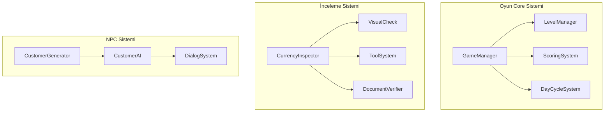

# Money or Honey

Papers, Please'ten ilham alan, bankada vezneci olarak çalışan oyuncunun sahte para, kara para ve şüpheli işlemleri tespit etmeye çalıştığı 2D pixel art web oyunu.

**Motor:** Godot 4.x  
**Platform:** Web (HTML5)  
**Tür:** Simülasyon / Tespit Oyunu

## Oynanış

Banka veznesinde çalışan bir memur olarak, müşterilerin getirdiği paraları inceleyip sahte olup olmadıklarına karar verirsiniz. Farklı araçlar kullanarak paraları kontrol eder, belgeleri doğrular ve kara para şüphelilerini tespit edersiniz.

### Özellikler

- **5 Seviye**: Artan zorlukla temel incelemeden uzman seviyesine
- **3 Para Birimi**: USD, EUR, GBP
- **4 Tespit Aracı**: Büyüteç, UV Lamba, Terazi, Mikroskop
- **Belge Kontrolü**: Fatura, dekont ve kimlik eşleştirme
- **Kara Para Tespiti**: Kaynak kontrolü ve tutarlılık analizi
- **Müşteri AI**: Normal, dikkatsiz, şüpheli ve profesyonel dolandırıcı tipleri

## Seviyeler

| Seviye | Ad | Para Birimleri | Araçlar | Mekanikler |
|--------|-----|----------------|---------|------------|
| 1 | İş Başlangıcı | USD | - | Temel görsel inceleme |
| 2 | Araç Kutusu | USD, EUR | Büyüteç, UV | Araç kullanımı |
| 3 | Belge Kontrolü | USD, EUR, GBP | + Terazi | Belge eşleştirme |
| 4 | Kara Para Avcısı | USD, EUR, GBP | + Mikroskop | Kara para tespiti |
| 5 | Uzman Vezneci | USD, EUR, GBP | Tümü | Tüm mekanikler, zaman baskısı |

## Kurulum

### Gereksinimler
- [Godot 4.2+](https://godotengine.org/download)

### Çalıştırma

1. Godot 4.x'i açın
2. "Import" butonuna tıklayın
3. Proje klasörünü seçin (`project.godot` dosyası)
4. "Import & Edit" butonuna tıklayın
5. F5 ile oyunu çalıştırın

### Web Export

1. Godot'ta `Project > Export` menüsünü açın
2. "Web" preset'i ekleyin
3. "Export Project" ile çıktı alın
4. `export/web/` klasöründeki dosyaları bir web sunucusuna yükleyin

**Not:** Web export için Godot export template'lerini indirmeniz gerekir:
- `Editor > Manage Export Templates` menüsünden template'leri indirin
- Web platformu için "Download and Install" seçeneğini kullanın

**Test için yerel sunucu:**
```bash
cd export/web
python3 -m http.server 8000
# Tarayıcıda http://localhost:8000 adresini açın
```

**Production için:**
- `.htaccess` dosyası Apache sunucuları için MIME type yapılandırması içerir
- nginx için benzer yapılandırmayı `nginx.conf` dosyasına ekleyin
- WASM dosyaları için `application/wasm` MIME type'ı gereklidir

## Proje Yapısı

```
money-or-honey/
├── project.godot
├── assets/
│   ├── sprites/          # Pixel art görseller
│   ├── fonts/            # Pixel fontlar
│   └── audio/            # Ses efektleri
├── scenes/
│   ├── main/             # Ana menü ve oyun sahnesi
│   ├── gameplay/         # Oynanış sahneleri
│   ├── npcs/             # Müşteri sahneleri
│   ├── currency/         # Banknot sahneleri
│   └── ui/               # UI sahneleri
├── scripts/
│   ├── autoload/         # Singleton scriptler
│   ├── gameplay/         # Oyun mantığı
│   ├── currency/         # Para birimi sistemi
│   └── ui/               # UI scriptleri
└── data/
    ├── currencies.json   # Para birimi verileri
    ├── levels.json       # Seviye tanımları
    ├── customers.json    # Müşteri profilleri
    └── fake_patterns.json # Sahte para desenleri
```

## Kontroller

| Tuş | İşlev |
|-----|--------|
| 1 | Büyüteç |
| 2 | UV Lamba |
| 3 | Terazi |
| 4 | Mikroskop |
| Space | Parayı kabul et |
| Escape | Parayı reddet |

## Geliştirme

### Mimari



### Gelecek Özellikler

- Mobil port (touch kontrolleri)
- Ek para birimleri (JPY, CHF, AUD)
- Hikaye modu
- Endless mode
- Multiplayer yarışma

## Lisans

MIT License
